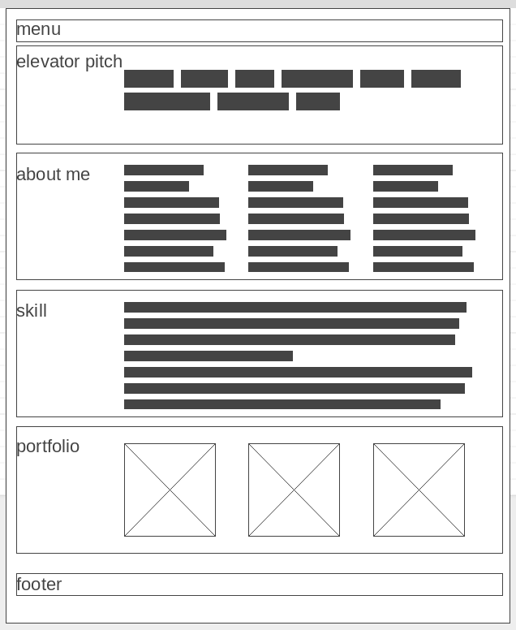

Docente:
Mauro BOgliaccino

Data:

# My Personal Web site

Esercitazione: progettare e realizzare un sito web con Bootstrap e Javascript / JQuery, utilizzando un tema a tua scelta.

Come prova in itinere del corso realizzate un portfolio web per mostrare i vostri lavori.

Per cominciare, pensa a te stesso come se fossi un cliente: "fai un briefing con te stesso" e annota tutti gli aspetti significativi della pubblicazione: come faresti con qualsiasi altro cliente!

Chi immagini come visitatore del tuo sito? Non potrà comunque essere interessante per tutti... Immagina il tuo pubblico, individua un obiettivo della tua comunicazione e rivolgiti ad esso.

Potresti creare delle categorie e dividere i tuoi lavori in base alle etichette (tag) o alle categorie. Mostra solo i lavori più significativi: è più importante la qualità che la quantità.

Qual è il tuo obiettivo: cerchi un lavoro fisso o ti proponi come free-lance?

Quale il profilo del cliente che cerchi? Definisci il tuo interlocutore tipo.

Metti in evidenza il tuo contatto e fai una breve presentazione nelle sezioni contact e about me.

## Requisiti minimi
Il sito può essere articolato in diverse pagine o anche essere single-page html5.

L'intestazione deve essere linkabile e contenere: nome, cognome e job title.

All'interno della pagina devi utilizzare glyphicon o font-awesome, o simili.

una cartella per css,
una per js e json,
una per immagini,
una per font.
elevator pitch:
la prima section è il punto di ingresso del tuo sito. Deve contenere un buon elevator pitch: è quel che diresti ad un interlocutore che ti chiede di cosa ti occupi, mentre l’ascensore vi porta velocemente al piano, non c’è molto tempo!, usa poche parole/frasi ben studiate.

Questa sezione può essere rappresentata con uno slideshow orizzontale. La sezione si deve differenziare anche a livello tipografico.

## about me:
la section deve impaginare una o più foto e una short bio. Se la biografia contiene diversi paragrafi, impostarla come slideshow orizzontale, con effetti di scorrimento delle slide.

## skill:
questa section rappresentata graficamente (con JQuery) che metta in evidenza le principali attività competenze e relativa autovalutazione

## corso di formazione:
prepara una sezione con elementi del corso: materie, qualifica, location, il tuo progetto in team, le schermate della tua app (o sito web), ...

## portfolio:
Il portfolio è una collezione fotografica (o slide graficamente curate) del lavoro realizzato.

Pensa al tuo portfolio come ad un progetto a se stante: il portfolio è solo una parte del tuo sito web personale. La sezione deve essere impaginata come una gallery. La galleria può essere inserita in uno slideshow orizzontale

## contact:
in questa sezione puoi indicare un indirizzo email ‘professionale’, i contatti social,

inserisci un modulo preimpostato per i contatti. Verifica con js che i campi siano correttamente compilati, altrimenti informa l'utente.

## footer:
completa la pagina con la sezione footer, puoi inserire firma, collegamenti social, pulsante "torna su", altre informazioni di contatto, ...

